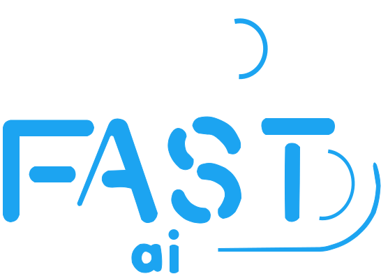
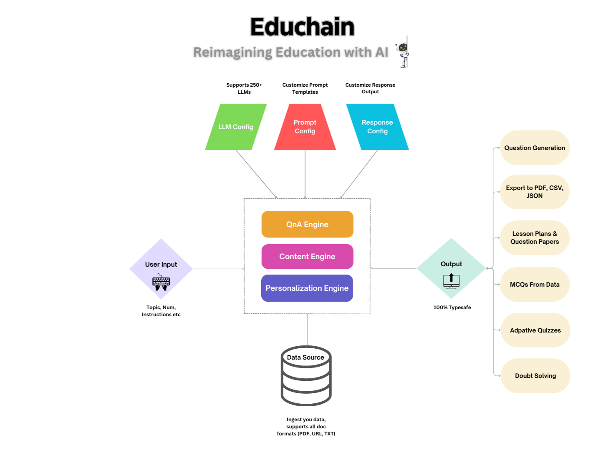

<p align="center">
  
</p>

<div align="center">
  
  [](https://badge.fury.io/py/educhain)
  [](https://opensource.org/licenses/MIT)
  [](https://pypi.org/project/educhain/)
  [](https://pepy.tech/project/educhain)

</div>

# Educhain 🎓🔗
[Website](https://educhain.in) | [Documentation](docs/index.md)

Educhain is a powerful Python package that leverages Generative AI to create engaging and personalized educational content. From generating multiple-choice questions to crafting comprehensive lesson plans, Educhain makes it easy to apply AI in various educational scenarios.



## 🚀 Features  

<details>
<summary>📝 Generate Multiple Choice Questions (MCQs)</summary>

````python
from educhain import Educhain

client = Educhain()

# Basic MCQ generation
mcq = client.qna_engine.generate_questions(
    topic="Solar System",
    num=3,
    question_type="Multiple Choice"
)

# Advanced MCQ with custom parameters
advanced_mcq = client.qna_engine.generate_questions(
    topic="Solar System",
    num=3,
    question_type="Multiple Choice",
    difficulty_level="Hard",
    custom_instructions="Include recent discoveries"
)

print(mcq.json())  # View in JSON format
````
</details>

<details>
<summary>📊 Create Lesson Plans </summary>

````python
from educhain import Educhain

client = Educhain()

# Basic lesson plan
lesson = client.content_engine.generate_lesson_plan(
    topic="Photosynthesis"
)

# Advanced lesson plan with specific parameters
detailed_lesson = client.content_engine.generate_lesson_plan(
    topic="Photosynthesis",
    duration="60 minutes",
    grade_level="High School",
    learning_objectives=["Understanding the process", "Identifying key components"]
)

print(lesson.json())
````
</details>

<details>
<summary>🔄 Support for Various LLM Models</summary>

````python
from educhain import Educhain, LLMConfig
from langchain_google_genai import ChatGoogleGenerativeAI
from langchain_openai import ChatOpenAI

# Using Gemini
gemini_model = ChatGoogleGenerativeAI(
    model="gemini-1.5-pro",
    google_api_key="YOUR_GOOGLE_API_KEY"
)
gemini_config = LLMConfig(custom_model=gemini_model)
gemini_client = Educhain(gemini_config)

# Using GPT-4
gpt4_model = ChatOpenAI(
    model_name="gpt-4",
    openai_api_key="YOUR_OPENAI_API_KEY"
)
gpt4_config = LLMConfig(custom_model=gpt4_model)
gpt4_client = Educhain(gpt4_config)
````
</details>

<details>
<summary>📁 Export Questions to Different Formats</summary>

````python
from educhain import Educhain

client = Educhain()
questions = client.qna_engine.generate_questions(topic="Climate Change", num=5)

# Export to JSON
questions.json("climate_questions.json")

# Export to PDF
questions.to_pdf("climate_questions.pdf")

# Export to CSV
questions.to_csv("climate_questions.csv")
````
</details>

<details>
<summary>🎨 Customizable Prompt Templates</summary>

````python
from educhain import Educhain

client = Educhain()

# Custom template for questions
custom_template = """
Generate {num} {question_type} questions about {topic}.
Ensure the questions are:
- At {difficulty_level} level
- Focus on {learning_objective}
- Include practical examples
- {custom_instructions}
"""

questions = client.qna_engine.generate_questions(
    topic="Machine Learning",
    num=3,
    question_type="Multiple Choice",
    difficulty_level="Intermediate",
    learning_objective="Understanding Neural Networks",
    custom_instructions="Include recent developments",
    prompt_template=custom_template
)
````
</details>

<details>
<summary>📚 Generate Questions from Files</summary>

````python
from educhain import Educhain

client = Educhain()

# From URL
url_questions = client.qna_engine.generate_questions_from_data(
    source="https://example.com/article",
    source_type="url",
    num=3
)

# From PDF
pdf_questions = client.qna_engine.generate_questions_from_data(
    source="path/to/document.pdf",
    source_type="pdf",
    num=3
)

# From Text File
text_questions = client.qna_engine.generate_questions_from_data(
    source="path/to/content.txt",
    source_type="text",
    num=3
)
````
</details>

<details>
<summary>📹 Generate Questions from YouTube Videos     </summary>

````python
from educhain import Educhain

client = Educhain()

# Basic usage - Generate 3 MCQs from a YouTube video
questions = client.qna_engine.generate_questions_from_youtube(
    url="https://www.youtube.com/watch?v=dQw4w9WgXcQ",
    num=3
)
print(questions.json())

# Generate questions preserving original language
preserved_questions = client.qna_engine.generate_questions_from_youtube(
    url="https://www.youtube.com/watch?v=dQw4w9WgXcQ",
    num=2,
    target_language='hi',
    preserve_original_language=True  # Keeps original language
)
````
</details>

<details>
<summary>🥽 Generate Questions from Images      </summary>

````python
from educhain import Educhain

client = Educhain() #Default is 4o-mini (make sure to use a multimodal LLM!)

question = client.qna_engine.solve_doubt(
    image_source="path-to-your-image",
    prompt="Explain the diagram in detail",
    detail_level = "High" 
    )

print(question)
````
</details>

<details>
<summary>🥽 Generate Visual Questions     </summary>

````python
from langchain_google_genai import ChatGoogleGenerativeAI
from educhain import Educhain, LLMConfig

gemini_flash = ChatGoogleGenerativeAI(model="gemini-2.0-flash", google_api_key=GOOGLE_API_KEY)

flash_config = LLMConfig(custom_model=gemini_flash)

client = Educhain(flash_config)

ques = client.qna_engine.generate_visual_questions(
        topic="GMAT Statistics", num=10 )

print(ques.json)
````
</details>

## 📈 Workflow

**Reimagining Education with AI** 🤖
- 📜 QnA Engine: Generates an infinte variety of Questions
- 📰 Content Engine: One-stop content generation - lesson plans, flashcards, notes etc
- 📌 Personalization Engine: Adapts to your individual level of understanding for a tailored experience.



## 🛠 Installation

```bash
pip install educhain
```

## 🎮 Usage

## Starter Guide

[](https://colab.research.google.com/drive/1JNjQz20SRnyRyAN9YtgCzYq4gj8iBTRH?usp=chrome_ntp#scrollTo=UtLn9rOF-gPm)

### Quick Start

Get started with content generation in < 3 lines! 

```python
from educhain import Educhain

client = Educhain()

ques = client.qna_engine.generate_questions(topic="Newton's Law of Motion",
                                            num=5)
print(ques)
ques.json() # ques.dict()
```

### Supports Different Question Types

Generates different types of questions. See the advanced guide to create a custom question type. 


```python
# Supports "Multiple Choice" (default); "True/False"; "Fill in the Blank"; "Short Answer"

from educhain import Educhain

client = Educhain()

ques = client.qna_engine.generate_questions(topic = "Psychology", 
                                            num = 10,
                                            question_type="Fill in the Blank"
                                            custom_instructions = "Only basic questions")

print(ques)
ques.json() #ques.dict()
```

### Use Different LLM Models

To use a custom model, you can pass a model configuration through the `LLMConfig` class

Here's an example using the Gemini Model

```python
from langchain_google_genai import ChatGoogleGenerativeAI
from educhain import Educhain, LLMConfig

gemini_flash = ChatGoogleGenerativeAI(
    model="gemini-1.5-flash-exp-0827",
    google_api_key="GOOGLE_API_KEY")

flash_config = LLMConfig(custom_model=gemini_flash)

client = Educhain(flash_config) #using gemini model with educhain

ques = client.qna_engine.generate_questions(topic="Psychology",
                                            num=10)

print(ques)
ques.json() #ques.dict()
```

### Customizable Prompt Templates 

Configure your prompt templates for more control over input parameters and output quality. 

```python
from educhain import Educhain

client = Educhain()

custom_template = """
Generate {num} multiple-choice question (MCQ) based on the given topic and level.
Provide the question, four answer options, and the correct answer.
Topic: {topic}
Learning Objective: {learning_objective}
Difficulty Level: {difficulty_level}
"""

ques = client.qna_engine.generate_questions(
    topic="Python Programming",
    num=2,
    learning_objective="Usage of Python classes",
    difficulty_level="Hard",
    prompt_template=custom_template,
)

print(ques)
```


### Generate Questions from Data Sources

Ingest your own data to create content. Currently supports URL/PDF/TXT.

```python
from educhain import Educhain
client = Educhain()

ques = client.qna_engine.generate_questions_from_data(
    source="https://en.wikipedia.org/wiki/Big_Mac_Index",
    source_type="url",
    num=5)

print(ques)
ques.json() # ques.dict()
```


### Generate Lesson Plans

Create interactive and detailed lesson plans. 

```python
from educhain import Educhain

client = Educhain()

plan = client.content_engine.generate_lesson_plan(
                              topic = "Newton's Law of Motion")

print(plan)
plan.json()  # plan.dict()
```


## 📊 Supported Question Types

- Multiple Choice Questions (MCQ)
- Short Answer Questions
- True/False Questions
- Fill in the Blank Questions

## 🔧 Advanced Configuration

Educhain offers advanced configuration options to fine-tune its behavior. Check our [advanced guide]() for more details. (coming soon!)

## 🌟 Success Stories

Educators worldwide are using Educhain to transform their teaching. Read our [case studies](https://educhain.ai/case-studies) to learn more.

<!-- ## 📈 Usage Statistics

Educhain's adoption has been growing rapidly:

 -->

## 🗺 Roadmap

- [x] Bulk Generation
- [x] Outputs in JSON format
- [x] Custom Prompt Templates
- [x] Custom Response Models using Pydantic
- [x] Exports questions to JSON/PDF/CSV
- [x] Support for other LLM models
- [x] Generate questions from text/PDF file
- [ ] Integration with popular Learning Management Systems
- [ ] Mobile app for on-the-go content generation

## 🤝 Open Source Contributions Welcome!

We invite you to help enhance our library. If you have **any ideas, improvements, or suggestions for enhancements** to contribute, please open a [GitHub issue](https://github.com/satvik314/educhain/issues) or submit a pull request. Be sure to adhere to our existing project structure and include a detailed README.md for any new Contribution.

Thank you for your continued support, community!

[](https://star-history.com/#satvik314/educhain&Date)


## 📄 License

This project is licensed under the MIT License - see the [LICENSE](LICENSE) file for details.

## 📬 Contact

- For general inquiries: [educhain.in](https://educhain.in)
- For technical support: [satvik@buildfastwithai.com](mailto:satvik@buildfastwithai.com)
- Follow us on [Twitter](https://x.com/EduchainWithAI)

---


Made with ❤️ by Buildfastwithai

[www.educhain.in](https://educhain.in)
```

You can now copy and paste this directly into your project!
