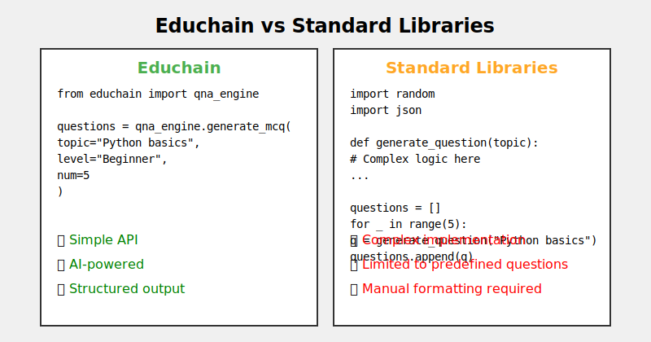

<p align="center">
  
</p>

<div align="center">
  
  [](https://badge.fury.io/py/educhain)
  [](https://opensource.org/licenses/MIT)
  [](https://pypi.org/project/educhain/)
  [](https://pepy.tech/project/educhain)

</div>

# Educhain 🎓🔗
[Website](https://educhain.in) | [Documentation](docs/index.md)

Educhain is a powerful Python package that leverages Generative AI to create engaging and personalized educational content. From generating multiple-choice questions to crafting comprehensive lesson plans, Educhain makes it easy to apply AI in various educational scenarios.


## 🚀 Features

- 📝 Generate Multiple Choice Questions (MCQs)
- 📊 Create Lesson Plans
- 🔄 Support for various LLM models
- 📁 Export questions to JSON, PDF, and CSV formats
- 🎨 Customizable prompt templates
- 📚 Generate questions from text/PDF/URL files
- 📹 Generate questions from YouTube videos
- 🥽 Generate questions from images

## 📈 Performance

Educhain consistently outperforms traditional methods in content generation speed and quality:



## 🛠 Installation

```bash
pip install educhain
```

## 🎮 Usage

### Generate MCQs

[](https://colab.research.google.com/drive/1ImijJ-DF8XGTzyLJ0lq68yInrPN1-L8L?usp=sharing)

#### Quick Start

```python
from educhain.engines import qna_engine

ques = qna_engine.QnAEngine()

questions = ques.generate_questions(
    topic="Python programming",
    num=2
)
questions.show()
```

#### Generate Questions from Data Sources

```python
from educhain.engines import qna_engine

ques = qna_engine.QnAEngine()

data_ques = ques.generate_questions_from_data(
    source="https://en.wikipedia.org/wiki/Main_Page",
    source_type="url",
    num=2
)
data_ques.show()
```

#### Generate MCQs with Custom Instructions

```python
from educhain.engines import qna_engine

ques = qna_engine.QnAEngine()

data_ques = ques.generate_questions_with_rag(
    source="https://lichess.org/forum/off-topic-discussion/longest-message-ever?page=3",
    source_type="url",
    num=2,
    custom_instructions="Include questions about the 15th day of the Month of August."
)
data_ques.show()
```

#### Generate Math MCQs

```python
from educhain.engines import qna_engine

ques = qna_engine.QnAEngine()

data_ques = ques.generate_mcq_math(
    topic="division of complicated decimals up to 7 decimals",
    num=2
)
data_ques.show()
```

### Generate Lesson Plans

```python
from educhain.engines import content_engine

content_engine = content_engine.ContentEngine()

lesson_plan = content_engine.generate_lesson_plan(
    topic="Trigonometry", 
    custom_instructions="Include real-world examples"
)
lesson_plan.show()
```

## 🧠 Using Custom Models in Educhain

Educhain allows you to integrate your own custom models for generating questions and lesson plans. This flexibility lets you fine-tune the AI's behavior to suit your specific needs, whether it's a proprietary language model or an open-source one.

### Example: Using a Custom Language Model (LLM)

To use a custom model, you can pass a model configuration through the `LLMConfig` class and use it with the content generation engines. Here's how to do it:

```python
from educhain.engines import content_engine
from educhain.core import config
from langchain.chat_models import ChatOpenAI

# Initialize your custom model (e.g., Llama 3.1-70b)
llama = ChatOpenAI(
    model="llama-3.1-70b-versatile",
    openai_api_base="https://api.groq.com/openai/v1",
    openai_api_key=userdata.get("GROQ_API_KEY")  # Your custom model's API key
)

# Create a custom configuration for Educhain's content engine
llm_config = config.LLMConfig(custom_model=llama)

# Initialize the content engine with your custom model
content_engine = content_engine.ContentEngine(llm_config=llm_config)

# Generate a lesson plan with your custom model
lesson_plan = content_engine.generate_lesson_plan(
    topic="Trigonometry", 
    custom_instructions="Include real-world examples"
)
lesson_plan.show()

```
## 📊 Supported Question Types

- Multiple Choice Questions (MCQ)
- Short Answer Questions
- True/False Questions
- Fill in the Blank Questions

## 🔧 Advanced Configuration

Educhain offers advanced configuration options to fine-tune its behavior. Check our [configuration guide](https://docs.educhain.ai/configuration) for more details.

## 🌟 Success Stories

Educators worldwide are using Educhain to transform their teaching. Read our [case studies](https://educhain.ai/case-studies) to learn more.

## 📈 Usage Statistics

Educhain's adoption has been growing rapidly:


## 🗺 Roadmap

- [x] Bulk Generation
- [x] Outputs in JSON format
- [x] Custom Prompt Templates
- [x] Custom Response Models using Pydantic
- [x] Exports questions to JSON/PDF/CSV
- [x] Support for other LLM models
- [x] Generate questions from text/PDF file
- [ ] Integration with popular Learning Management Systems
- [ ] Mobile app for on-the-go content generation

## 🤝 Contributing

We welcome contributions! Please see our [Contribution Guide](CONTRIBUTING.md) for more details.

## 📄 License

This project is licensed under the MIT License - see the [LICENSE](LICENSE) file for details.

## 📬 Contact

- For general inquiries: [educhain.in](https://educhain.in)
- For technical support: [satvik@buildfastwithai.com](mailto:satvik@buildfastwithai.com)
- Follow us on [Twitter](https://twitter.com/educhain_ai)

For bug reports or feature requests, please open an issue on our [GitHub repository](https://github.com/educhain/educhain).

---


Made with ❤️ by Buildfastwithai

[www.educhain.in](https://educhain.in)
```

You can now copy and paste this directly into your project!
